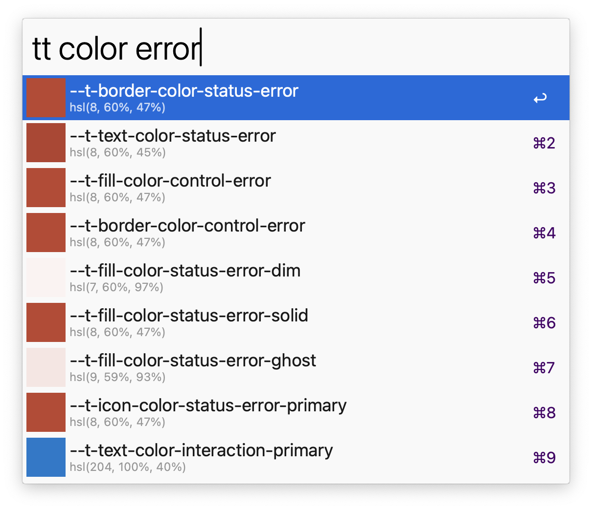

# Tapestry Tokens Alfred Extension

Search Tapestry design tokens using `tt`.

[Download the Alfred extension](https://github.com/starzonmyarmz/tapestry-tokens-alfred-extension/releases/download/1.0.0/tapestry-tokens.alfredworkflow) and double-click to install.

---

## About development

Vibe coded using [Claude Code](https://docs.anthropic.com/en/docs/claude-code/overview). The initial release took roughly $10 worth of tokens over 2.5 hours of interfacing with Claude.